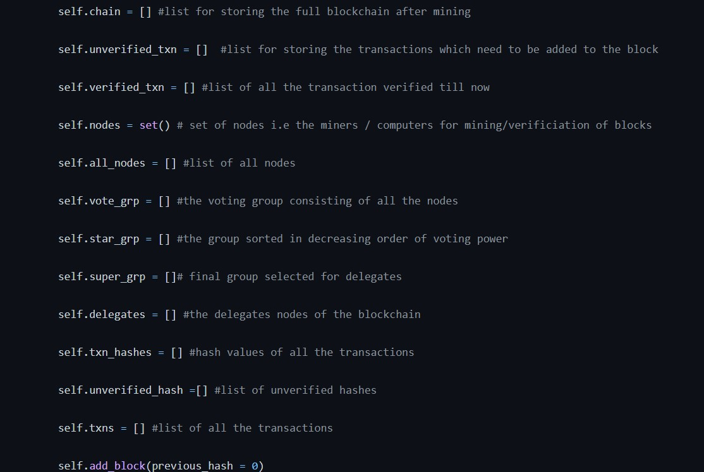
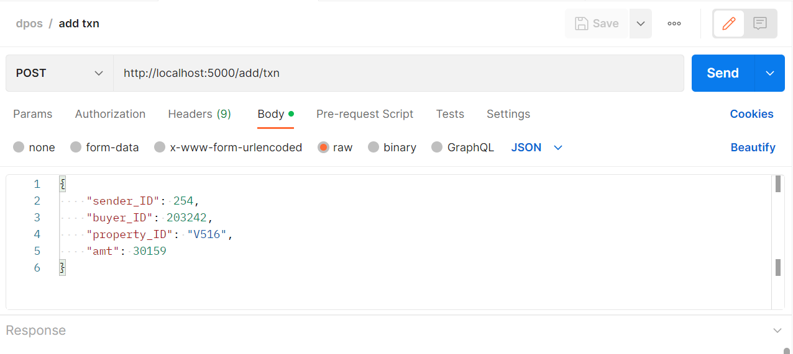
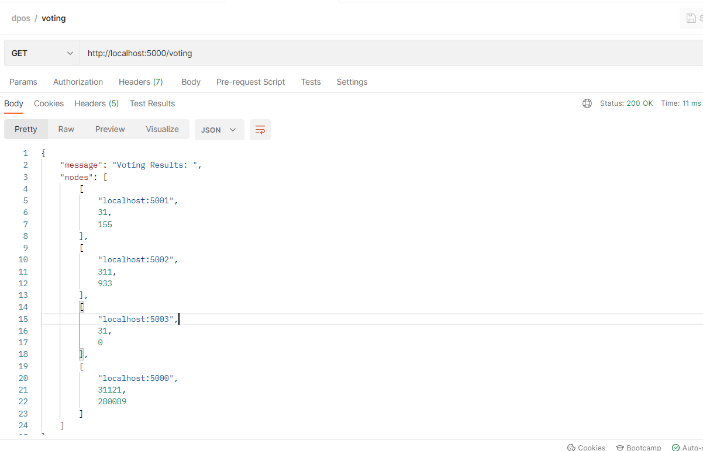
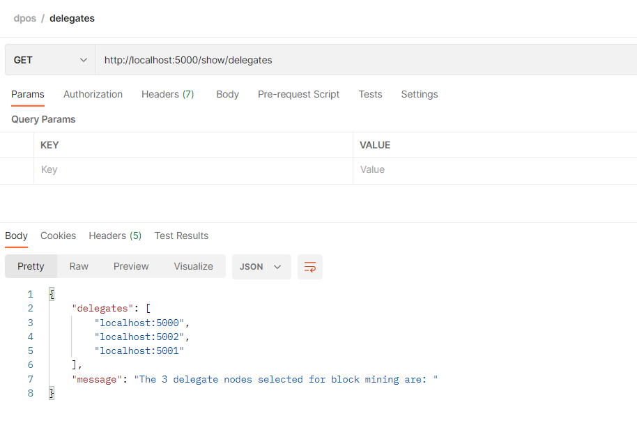
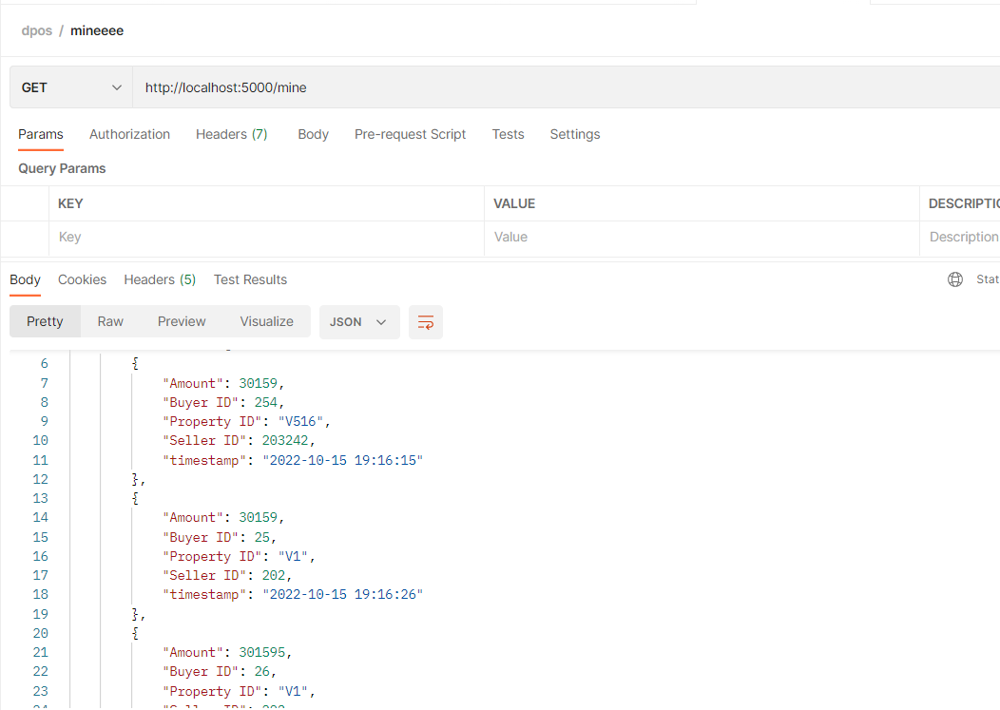
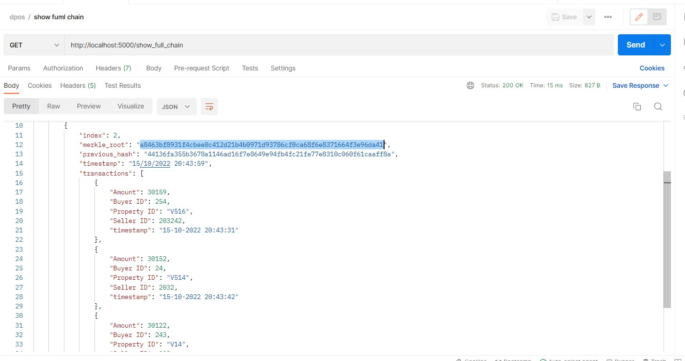

# landmine

### __init__ 

Constructor defining all the lists and variables required for the blockchain network.

Intially the previous hash for the genesis block is defined as 0.

### add_block

A block containing the transaction list in block data and merkle root, timestamp, index and previous hash in block header is added to the blockchain network.
The timestamp has date in ("%d/%m/%Y %H:%M:%S") format.

### new_txn

Adds new transactions between two parties for a particular property using all the required attributes:
'Buyer ID'
'Seller ID'
'Property ID'
'Amount'

### validate_txn

The unverified transacitons are added to the verified transaction list during mining of the block.

### calc_hash

Calculates hash value using SHA256 for hash of previous block as well as merkle root hash calculation.

### txn_history

Returns the history of transactions sorted by timestamp for a particular Property_ID

### voting_power

Multiplies the stake of each block with a random integer between 1 to 10 for the delegates who will mine the block into the blockchain.

### delegates_selection

Only 3 delegates are selected based on the voting results from the above function

### mine

The given block is mined and added into the blockchain.
THe unverified transactions are then verified and unverified transaction list is made empty.

### merkle_tree

Implemented by calculating final hash from all the transactions from the given block in the merkle root.
This is stored in the block header.

